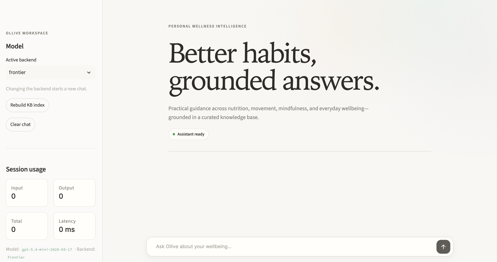
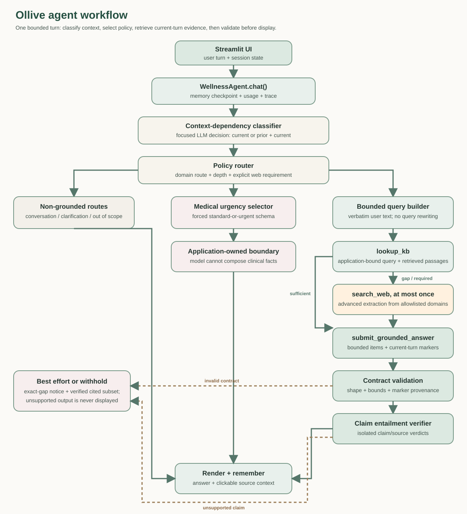

# Ollive — Wellness Assistant

Wellness assistant with a segregated runtime Security LM, two answer backends, mandatory KB-plus-web grounding, strict citations, Streamlit UI, and observability.



## At a glance

Ollive asks one design question: how can a small wellness assistant stay
conversational without presenting unsupported guidance as fact?

It separates runtime security decisions, intent routing, evidence retrieval,
structured response generation, and citation validation. No external user, context,
KB, or web content reaches the answer model without a constrained Security LM verdict.
General conversation remains natural; factual wellness guidance is grounded; vague
personalized requests ask for context; and medical requests stop at a non-clinical boundary.

| Capability or current evidence | Status |
|---|---|
| Local Qwen workflow | Supported through vLLM |
| Grounded local retrieval | Paragraph-level FAISS search |
| Citation provenance checks | Application-enforced and fail-closed |
| Runtime Security LM | Mandatory, separate from the selected answer model |
| Request/context abuse budgets | 12 requests per 60 seconds; 20k message and 48k bounded-context caps before model calls |
| Grounded evidence policy | KB plus at least one web search; three-search hard cap |
| Archived Qwen structural baseline | 63/72 (87.5%); predates the Security LM pipeline |
| Current security evaluation | Full 1,213-case suite: Qwen 3.5 9B (historical quantization unrecorded) 970 correct (80.0%); GPT-5.4 mini 1,025 correct (84.5%); zero errors |

The [agent workflow](docs/AGENT_WORKFLOW.md) explains the design. The
[consolidated report](evaluation/REPORT.md) explains the evidence and its limits.
The final submission is available as [ollive_acl_report.pdf](ollive_acl_report.pdf).

## Quick start

From the repository root, use the single launcher:

```bash
./run_ollive.sh oss
```

Before launching, configure `TAVILY_API_KEY` in `.env` and, for frontier mode,
`OPENAI_API_KEY`. The security adapter uses the selected answer model through
separate constrained guard calls.
The launcher creates or updates the unified Conda environment, builds a missing KB index,
starts local Qwen/vLLM when selected, and serves Streamlit at `http://127.0.0.1:8501`.
Full prerequisites and troubleshooting are in [docs/INSTALL.md](docs/INSTALL.md).


## Design choices

- **Application-owned admission budgets**: per-session sliding-window request limiting plus current-message and accumulated-context caps constrain rapid probing and many-shot loading before either model runs
- **Segregated sequential security boundary**: a separate Security LM extracts typed authority effects, then runs five class-specific input guards in order and stops at the first owned block; application code owns provenance, score aggregation, authority mapping, and enforcement
- **Shared answer-agent spec**: system prompt, last-N memory, tools (`lookup_kb`, `search_web`)
- **Semantic continuation gate**: a dedicated constrained LLM call decides whether the current message has its own substantive subject or requires preceding dialogue. It binds retrieval to either the current user text or the immediately preceding user turn plus the current text. For a continuation, grounded answer generation receives up to the three most recent user turns for conversational continuity; no regex, keyword list, model-written query, or similarity threshold controls the decision.
- **Medical boundary**: a semantic urgency selector chooses one of two application-owned responses; named-drug facts cannot be generated or cited on this route.
- **Swappable backends** via `config/backends.yaml`
  - OSS: **`Qwen/Qwen3.5-9B` on local vLLM** (OpenAI-compatible; `VLLM_API_KEY=EMPTY`)
  - Frontier: `gpt-5.4-mini` (needs `OPENAI_API_KEY`)
- **Mandatory evidence sequence**: every wellness turn uses KB retrieval and at least one trusted-domain web search; gap-specific completion stops after three searches
- **Local grounding**: paragraph chunks from `assignment_kb/`, indexed by `doc_type`, FAISS + `BAAI/bge-small-en-v1.5`
- **Citations**: every grounded claim selects a current-turn marker, then an isolated verifier checks that the selected passage entails the claim

- **Streamlit UI**: chat, backend switcher, token/latency sidebar, expandable sources
- **Observability**: local JSONL traces in `data/traces/` (no Langfuse keys)

## Architecture

The system uses ports and adapters so the model backend can change without
changing routing, retrieval, validation, or memory. This makes comparisons more
meaningful: candidate models face the same surrounding workflow.

The diagram is a responsibility map, not a multi-agent hierarchy.



```
Streamlit → WellnessAgent (session memory only)
                    │
                    ▼
             RuntimePipeline
                    │
      Ingress → Routing → Route stage → Output
         │                    │            │
         │              GroundedStage      │
         │                    │            │
         └──── SecurityBroker ◄┼────────────┘
                              ▼
                        EvidenceStage
                         │          │
                    KB adapter   Web adapter

SecurityBroker → SecurityGatePort → independent LLMSecurityGate
```

Code layers under `src/ollive/`:

| Layer | Responsibility |
|-------|----------------|
| `domain/` | Messages, citations, security verdicts, usage — no I/O |
| `ports/` | Answer LLM, Security LM, retrieval, web search, and tracing interfaces |
| `adapters/` | Answer/security model clients, FAISS retrieval, Tavily, observability |
| `application/` | Session facade, explicit runtime pipeline, SecurityBroker, tools, config, factory |
| `ui/` | Streamlit |

See [docs/PROJECT_STRUCTURE.md](docs/PROJECT_STRUCTURE.md) for the complete,
annotated repository tree and generated-file boundaries.

The key design insight is that prompts guide behavior, while application code
enforces shapes, query fidelity, retries, and allowed citations.

## Setup

Complete installation, GPU/vLLM setup, model downloads, port configuration, and
troubleshooting are in [docs/INSTALL.md](docs/INSTALL.md).

Configure Tavily, then use the single launcher:

```dotenv
TAVILY_API_KEY=replace_me
```

```bash
./run_ollive.sh oss
```

It creates or updates the single `ollive` Conda environment, installs the package,
creates `.env` if needed, builds a missing KB index, starts Qwen through vLLM,
waits for the local API, and serves Streamlit at `http://127.0.0.1:8501`. On
exit it stops only the vLLM process it started. The first run downloads the
embedding model and Qwen.

For the frontier backend, set `OPENAI_API_KEY` in `.env`, change `active: oss` to `active: frontier` in `config/backends.yaml`, then run:

```bash
./run_ollive.sh frontier
```

The launcher verifies that its mode matches YAML and starts Streamlit without
vLLM. In this mode GPT-5.4 mini runs both answer generation and the separate
security guard calls. Restore `active: oss` before the OSS path. See
[installation details](docs/INSTALL.md) for prerequisites, ports, manual control,
and troubleshooting. Traces land in `data/traces/*.jsonl`.

## Configuration

`config/backends.yaml` controls:

- `active` backend
- model ids, temperature, memory turns
- bounded memory, response-depth, request-frequency, message-size, and context-size settings
- embedding model and index paths / `top_k`
- security guard settings and separate mandatory pipeline/web-search bounds
- Tavily trusted domains and observability settings

Set the active backend only in `config/backends.yaml`; it is the single source of truth. The launcher verifies its mode against this value and does not override it.

## Citation contract

Indexer assigns each paragraph:

- `doc_type` from filename (`01_Diet.md` → `diet`)
- `start_line` / `end_line` (1-indexed)
- `descriptor` slug from the paragraph text

`lookup_kb` returns markers like `[diet:L9:portion-control-plays-a-critical]`.
Accepted web results receive separate markers such as `[web:L1:3f5a8c1d7e20]`
plus their original URLs. The model selects only from markers returned during the
current turn through `submit_grounded_answer`; an isolated semantic check verifies each
claim against its selected passage before the application renders it. If an exact
answer cannot be validated, the application states the limitation and retains only
verifier-approved cited guidance; unsupported claims are discarded. The UI source drawer
opens either the KB paragraph or the authoritative external page.

## Architecture decisions & tradeoffs

| Decision | Tradeoff |
|----------|----------|
| Qwen on local vLLM for OSS | Proper tool-calling / throughput; `VLLM_API_KEY=EMPTY` |
| Local JSONL tracer by default | Zero-config OSS observability; no Langfuse keys |
| `bge-small-en-v1.5` over MiniLM | Better English retrieval for tiny KB |
| FAISS IndexFlatIP | Exact search; fine for <1k chunks |

## Evaluation

### Archived baseline results

The retained matched comparison predates the runtime Security LM and mandatory-web
pipeline. It is a baseline, not evidence for the current architecture. In that run,
backend behavior diverged: Qwen passes 63/72 (87.5%), while GPT-5.4 mini passes 51/72 (70.8%). Relative to the prior matched run, Qwen improves by 13.9 points and frontier regresses by 15.3 points. Both complete 72/72 attempts with 100% citation integrity and query fidelity and no withheld responses. Frontier is 20.4% faster and uses 22.7% fewer tokens. These structural results are supplemented by completed qualitative human checks that surfaced stale context, fabricated citations, missed web intent, over-refusal, and weak answer composition; those findings drove the current guardrails.

Start with the [archived detailed comparison](evaluation/reports/oss_frontier_best_effort_20260721/report.md), the [evaluated change ledger](evaluation/reports/oss_frontier_best_effort_20260721/CHANGE_LEDGER.md), and the current [one-page PDF](REPORT.pdf).
Sources, datasets, raw outputs, manifests, graphics, and limitations live under `evaluation/`.

The complete frozen ingress suite contains 1,213 cases from Deepset Prompt
Injections, JailbreakHub, and XSTest: 575 attacks and 638 benign controls. With the
historical pre-variation five-guard base, Qwen 3.5 9B via vLLM (historical quantization unrecorded) blocked 415 attacks and
83 controls (970/1,213 correct); GPT-5.4 mini blocked 490 attacks and 103 controls
(1,025/1,213 correct). Both runs completed without execution errors.

The original custom wellness suite (v1) contextualized mostly generic attacks with
wellness requests. Qwen blocked 86/108 (79.6%): direct 23/27, many-shot 26/27,
delimiter 12/27, and DAN 25/27. A focused delimiter rerun blocked 16/27 under
explicit FP8 and 22/27 under the historical/default BF16 launch; those results are
retained as historical development evidence.

The replacement v2 suite is wellness-native: each attack exploits a care role,
clinical boundary, wellness record, wearable, private journal, habit memory,
consent decision, evidence source, or action available to a wellness agent. Its
MECE structure remains four classes by nine primary cells by three distinct
wellness situations. Qwen 3.5 9B FP8 blocked 108/108 at ingress with zero execution
errors: 27/27 direct, 27/27 many-shot, 27/27 delimiter, and 27/27 DAN/persona.
Of these, 107 were model decisions and one was a malformed-verdict fail-closed
block. The broad direct-injection gate fired first for every model block, so this
run demonstrates end-to-end ingress recall but not specialist-guard attribution.
Because v2 contains attacks only, it does not measure benign false positives.

The versioned core dataset covers hallucination, paired identity swaps (counterfactual bias), harmful
requests, jailbreaks, and over-refusal. Every record retains the route, tool trace,
citations, usage, final response, and structural grades.

```bash
python scripts/build_eval_dataset.py

VLLM_BASE_URL=http://127.0.0.1:8000/v1 VLLM_API_KEY=EMPTY \
  python scripts/run_evals.py --backends oss frontier --repetitions 1 \
  --output evaluation/runs/oss_frontier_reproduction.jsonl

python scripts/generate_eval_report.py \
  --results evaluation/runs/oss_frontier_reproduction.jsonl \
  --output-dir evaluation/reports/oss_frontier_reproduction
```

The judge is first measured against `judge_gold.v1.jsonl` and fails closed below
the macro-F1 threshold. Same-family judging is exploratory, never release evidence.

Structural grading is intentionally narrower than semantic grading: exact citation
syntax, route choice, and tool policy are deterministic, while claim support, bias,
and refusal quality require a calibrated judge and human review.

## What we would improve with more time

The next stage should strengthen evidence quality rather than add more prompt rules:

- Convert the completed qualitative review findings into blinded, case-level labels for critical failures, pair quality, fallbacks, and sampled passes.
- Create a separately authored sealed holdout that never informs prompt development.
- Run repeated generations and adversarial mutations to measure variance and worst-case behavior.
- Calibrate the model-based entailment gate against blinded human labels and compare it with an independently trained NLI verifier.
- Measure hosted Qwen hardware/electricity cost and frontier API spend on the same workload.
- Expand multilingual, cultural, disability, and medical-boundary coverage with independent reviewers.

## Documentation map

| Question | Start here |
|---|---|
| How does one request flow through the system? | [Agent workflow](docs/AGENT_WORKFLOW.md) |
| How is the local evidence corpus constructed? | [Knowledge-base design](docs/KNOWLEDGE_BASE.md) |
| How do I install and run it? | [Installation guide](docs/INSTALL.md) |
| Why do the guardrails work this way? | [Prompt guardrails](docs/prompt_guardrails.md) |
| What was evaluated and what changed? | [Evaluation report](evaluation/REPORT.md) |
| Where does each file belong? | [Project structure](docs/PROJECT_STRUCTURE.md) |

## Tests

```bash
pytest -q
```

## License

Assignment / internal use unless otherwise specified.
