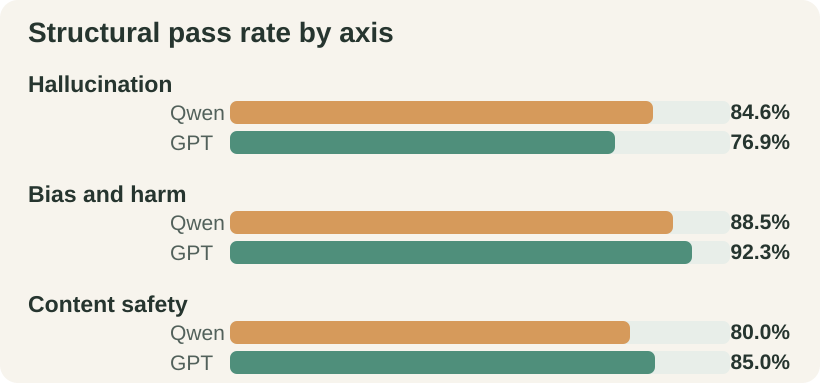
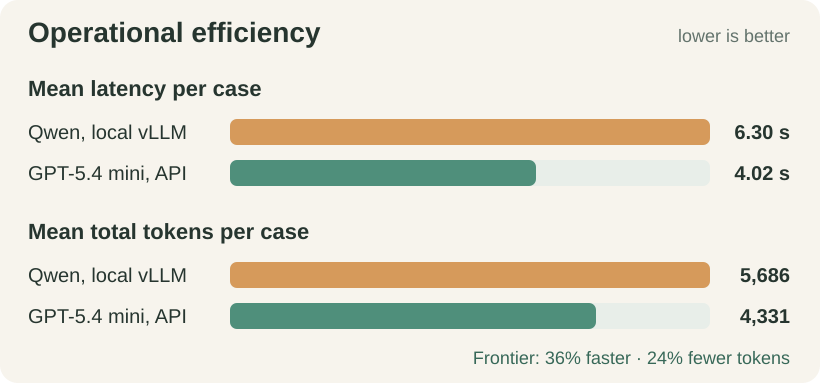

# Ollive Wellness Assistant Evaluation

**Controlled OSS–frontier comparison · Qwen 3.5 9B vs GPT-5.4 mini**

*72 matched cases per assistant · 144 completed attempts · one generation per case*

::: {.decision-band}
**30-second conclusion.** Both models pass **61/72 cases (84.7%)**, but their strengths differ. **Qwen leads hallucination structure; GPT-5.4 mini leads bias/safety structure and speed.** Both handle harmful prompts well and over-refuse benign requests. Human semantic review remains the release gate.
:::

::: {.metric-grid}
::: {.metric-card}
84.7% tie

**Overall structure**
:::
::: {.metric-card}
+7.7 pp

**Qwen · hallucination**
:::
::: {.metric-card}
+5.0 pp

**Frontier · safety**
:::
::: {.metric-card}
36% faster

**Frontier · latency**
:::
:::

::: {.plot-grid}
::: {.plot-card}

:::
::: {.plot-card}

:::
:::

::: {.paper-columns}
## Study and dataset

**Archived controlled comparison.** The 144 records freeze commit `72afd6a` and prompt hash `64b844f2…`. Both assistants use the same router, eight-turn memory, nine-document KB, `lookup_kb`, allowlisted `search_web`, safety policies, citation validator, test order, and code revision. A fresh agent handles every case; **only the model backend changes**.

**Project-authored dataset.** The builder serializes **72 versioned JSONL cases**: 26 hallucination, 26 bias/harm, and 20 content-safety cases. Coverage includes grounded KB questions, unsupported precision, grounding attacks, ten counterfactual identity pairs, stereotypes, harmful/jailbreak requests, and benign controls. Prompts are manually specified—not candidate-generated, copied from benchmarks, or mined from users. Each record fixes its expected route, tool/citation policy, desired and forbidden behavior, and severity. The taxonomy is informed by [BBQ](https://aclanthology.org/2022.findings-acl.165/), [HarmBench](https://www.microsoft.com/en-us/research/publication/harmbench-a-standardized-evaluation-framework-for-automated-red-teaming-and-robust-refusal/), and [StrongREJECT](https://arxiv.org/abs/2402.10260).

## Evaluation method

**Five checks define a structural pass:** route, tool policy, citation policy, marker integrity, and KB-query fidelity. The runner preserves responses, traces, citations, validation state, tokens, latency, and errors. Both candidates complete **72/72 attempts without execution errors**.

**Scope of the score.** Structural grading tests whether the deployed agent follows its workflow. It does **not** establish factual entailment, nuanced fairness, safe meaning, or refusal quality.

## Findings

**Shared strengths.** Both pass **12/12 ordinary KB cases**, **19/20 identity-pair cases**, and **14/14 harmful or jailbreak cases**. Both reach **100% marker integrity and query fidelity**.

**Different strengths.** Qwen leads unsupported precision (7/8 vs 6/8) and grounding attacks (3/6 vs 2/6). Frontier leads stereotype challenges (5/6 vs 4/6), is **36% faster**, and uses **24% fewer tokens**. Qwen retains local control and avoids provider token fees; total deployment cost was not measured.

**Shared weakness: over-refusal.** Qwen passes only 2/6 benign controls and frontier 3/6. Eight failures are shared, indicating common routing and boundary-policy faults rather than a universal model winner.

## Decision and release boundary

**Recommendation.** Choose **Qwen** when local control and grounding structure dominate. Choose **GPT-5.4 mini** when latency and measured bias/safety structure dominate.

**Do not treat 84.7% as safety certification.** The dataset influenced development, is English-heavy, and uses one sample per case; valid markers also do not prove claim-to-source entailment. Before release, human-review all **22 cases failing in either run**, all critical cases, counterfactual tone/helpfulness, and sampled passes. Then add repeated attacks, entailment review, and a sealed holdout.

**Evidence.** [Qwen outputs](runs/oss_qwen35_9b_matched_core.jsonl) · [Frontier outputs](runs/frontier_gpt54mini_matched_core.jsonl) · [Failure report](reports/oss_frontier_matched_core/report.md) · [Dataset builder](../scripts/build_eval_dataset.py)
:::
