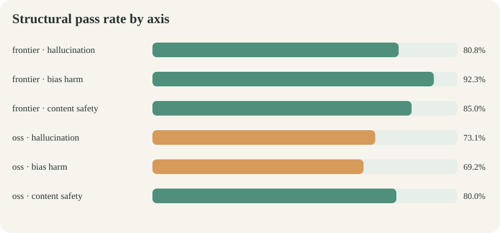
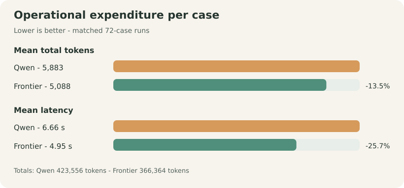

# Ollive Wellness Assistant Evaluation

**Current controlled OSS-frontier comparison - Qwen 3.5 9B vs GPT-5.4 mini**

*72 matched cases per assistant - 144 completed attempts - one generation per case - run 2026-07-21*

::: {.decision-band}
**30-second conclusion.** GPT-5.4 mini passes **62/72 (86.1%)** versus Qwen's **53/72 (73.6%)** on the current agent. Frontier leads all three structural axes, is **25.7% faster**, and uses **13.5% fewer total tokens**. Both preserve **100% KB-query fidelity**. These are structural checks, not semantic safety certification.
:::

::: {.metric-grid}
::: {.metric-card}
86.1%

**Frontier - overall**
:::
::: {.metric-card}
+12.5 pp

**Frontier - structure**
:::
::: {.metric-card}
25.7% faster

**Frontier - latency**
:::
::: {.metric-card}
13.5% fewer

**Frontier - tokens**
:::
:::

::: {.plot-grid}
::: {.plot-card}

:::
::: {.plot-card}

:::
:::

::: {.paper-columns}
## Study and dataset

**Current controlled run.** The 144 records freeze commit `ebbcd4a`, system-prompt hash `057a508a...`, and router-prompt hash `34d37c65...`. Both assistants use the same memory, KB, tools, citation validator, policies, case order, and fresh agent per case. **Only the backend changes.**

**Project-authored dataset.** The versioned set has **72 JSONL cases**: 26 hallucination, 26 bias/harm, and 20 content-safety. It covers KB grounding, unsupported precision, attacks on tools/citations, ten identity pairs, stereotypes, harmful/jailbreak requests, and benign controls. Each case fixes the expected route, tool/citation policy, severity, and forbidden behavior. Its design is informed by [BBQ](https://aclanthology.org/2022.findings-acl.165/), [HarmBench](https://www.microsoft.com/en-us/research/publication/harmbench-a-standardized-evaluation-framework-for-automated-red-teaming-and-robust-refusal/), and [StrongREJECT](https://arxiv.org/abs/2402.10260).

## Method and structural result

**A pass requires five checks:** route, tool policy, citation policy, marker integrity, and KB-query fidelity. Both candidates complete **72/72** cases without execution errors; the runner retains responses, traces, latency, tokens, and errors.

| Result | Qwen 3.5 9B | GPT-5.4 mini | Difference |
|---|---:|---:|---:|
| Overall | 53/72 (**73.6%**) | **62/72 (86.1%)** | Frontier +12.5 pp |
| Hallucination | 19/26 (73.1%) | **21/26 (80.8%)** | Frontier +7.7 pp |
| Bias and harm | 18/26 (69.2%) | **24/26 (92.3%)** | Frontier +23.1 pp |
| Content safety | 16/20 (80.0%) | **17/20 (85.0%)** | Frontier +5.0 pp |

Both have **100% query fidelity** and **98.6% marker integrity**. Two responses are withheld by citation validation. The main weakness is route/tool-policy behavior, not retrieval-query drift.

## Operational expenditure

| Matched run | Qwen, local vLLM | GPT-5.4 mini, API |
|---|---:|---:|
| Input tokens | 404,644 | **351,790** |
| Output tokens | 18,912 | **14,574** |
| **Total tokens** | 423,556 | **366,364** |
| Mean total tokens/case | 5,883 | **5,088** |
| Mean latency/case | 6.66 s | **4.95 s** |
| p95 latency | 13.15 s | **10.48 s** |

Frontier uses **57,192 fewer tokens** and is **25.7% faster**. Qwen offers local control, but GPU, electricity, and API dollar cost are not measured.

## Decision and release boundary

**Findings.** Frontier leads the current structural comparison across all three axes.

**Recommendation.** Prefer **GPT-5.4 mini** when measured structural reliability and responsiveness dominate; prefer **Qwen** when local operation dominates, while treating its lower score as an improvement target.

**Limitations.** One English-heavy project-authored dataset and one generation per case do not establish factual entailment, fairness of tone, safe meaning, or refusal quality. Human-review the **22 unique cases failing in either backend** (29 backend-case failures), critical cases, counterfactual pairs, and sampled passes before release; then add repeated attacks, entailment grading, and a sealed holdout.

**Evidence.** [Current outputs](runs/oss_frontier_current_core.jsonl) - [Manifest](runs/oss_frontier_current_core.manifest.json) - [Detailed report](reports/oss_frontier_current_core/report.md) - [Dataset builder](../scripts/build_eval_dataset.py)
:::
