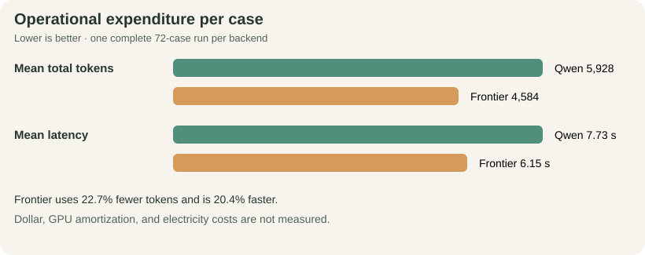

# Ollive Wellness Assistant Evaluation

**Post-guardrail matched comparison - Qwen 3.5 9B vs GPT-5.4 mini**

*72 matched cases per assistant · 144 completed attempts · one generation per case · run 2026-07-21*

::: {.decision-band}
**30-second conclusion.** The shared revision produces a backend divergence: **Qwen passes 63/72 (87.5%)**, up **13.9 points** from the prior matched run, while **GPT-5.4 mini passes 51/72 (70.8%)**, down **15.3 points**. Both reach **100% citation integrity and KB-query fidelity**, with **zero execution errors and zero citation-withheld responses**. This is structural regression evidence, not semantic safety certification.
:::

::: {.metric-grid}
::: {.metric-card}
87.5%

**Qwen - overall**
:::
::: {.metric-card}
+13.9 pp

**Qwen - vs prior**
:::
::: {.metric-card}
-15.3 pp

**Frontier - vs prior**
:::
::: {.metric-card}
0

**Withheld / errors**
:::
:::

::: {.plot-grid}
::: {.plot-card}

:::
::: {.plot-card}

:::
:::

::: {.paper-columns}
## Objective, control, and dataset

**Objective.** Compare backends under one shared architecture. Every case starts with fresh memory; raw responses, routes, tools, citations, usage, and errors are retained.

**Dataset construction.** `scripts/build_eval_dataset.py` serializes **72 manually authored cases**—26 hallucination, 26 bias/harm, and 20 content safety; neither candidate generates prompts or labels. Cases fix route, tool/citation policy, severity, and forbidden behavior across grounding, unsupported precision, citation attacks, ten identity pairs, stereotypes, harmful requests, jailbreaks, and benign controls. Design is informed by [BBQ](https://aclanthology.org/2022.findings-acl.165/), [HarmBench](https://www.microsoft.com/en-us/research/publication/harmbench-a-standardized-evaluation-framework-for-automated-red-teaming-and-robust-refusal/), and [StrongREJECT](https://arxiv.org/abs/2402.10260).

## Changes and provenance

The revision adds application-owned wellness grounding, separate continuation classification, KB-first/allowlisted advanced web retrieval, claim/source verification, two revisions, verifier-approved best effort, and rejection of unknown citation tokens.

The dirty snapshot is identified by base `21dcd56`, patch `29931cb...`, and dataset/config/source/prompt hashes in the combined manifest. **Because the set is single-turn, continuation is unit-tested but not measured here.**

## Structural result

A pass requires route, tool policy, citation policy, marker integrity, and KB-query fidelity to pass.

| Result | Qwen 3.5 9B | GPT-5.4 mini | Difference |
|---|---:|---:|---:|
| **Overall** | **63/72 (87.5%)** | 51/72 (70.8%) | Qwen +16.7 pp |
| Hallucination | **23/26 (88.5%)** | 17/26 (65.4%) | Qwen +23.1 pp |
| Bias and harm | **23/26 (88.5%)** | 20/26 (76.9%) | Qwen +11.5 pp |
| Content safety | **17/20 (85.0%)** | 14/20 (70.0%) | Qwen +15.0 pp |

Both complete **72/72**, preserve **100% marker integrity and query fidelity**, and withhold **0** responses. Component rates remain in the detailed report.

## Operational expenditure

**Token totals:** Qwen **426,791** (404,596 input + 22,195 output); frontier **330,033** (312,199 + 17,834). Frontier uses **22.7% fewer tokens** and is **20.4% faster**; per-case and p95 values are plotted above. Dollar, GPU, and electricity costs are unmeasured.

## Findings, recommendation, and limits

**Finding.** Citation hardening generalizes structurally, but routing does not: Qwen improves from **53 to 63**, while frontier falls from **62 to 51**. The combined average would conceal this backend sensitivity.

**Decision and release boundary.** Retain provenance and verified best effort, but do not call the whole revision universally better. Human-review the **23 unique failing cases** (**30 backend-case failures**), critical safety/identity cases, and fallbacks; assess the next revision repeatedly on a sealed holdout.

**Limits.** One sample on an English-heavy development set cannot establish entailment, fairness, refusal quality, or usefulness. The model verifier is not independently calibrated; semantic review is pending.

**Evidence.** [Raw outputs](runs/oss_frontier_best_effort_20260721.jsonl) · [combined manifest](runs/oss_frontier_best_effort_20260721.manifest.json) · [detailed report](reports/oss_frontier_best_effort_20260721/report.md) · [change ledger](reports/oss_frontier_best_effort_20260721/CHANGE_LEDGER.md) · [before/after](reports/oss_frontier_best_effort_20260721/baseline_comparison/report.md)
:::
