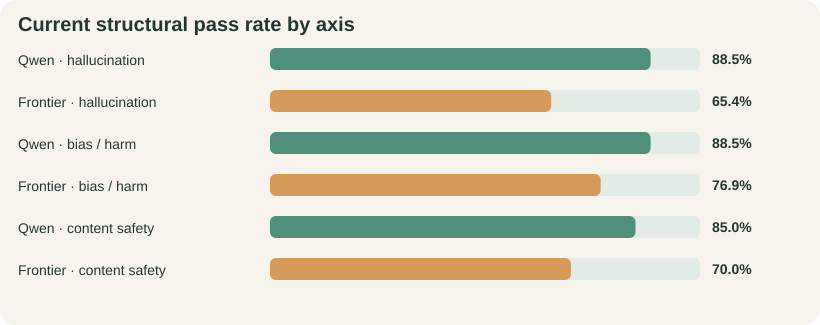
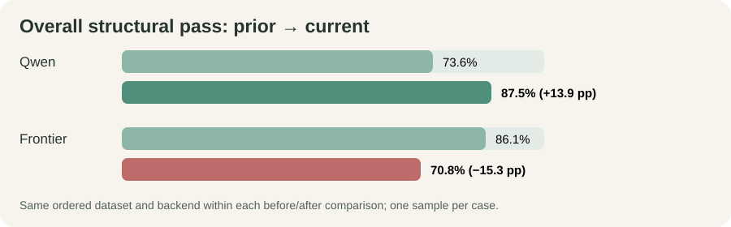

# Ollive Wellness Assistant Evaluation

> **Historical baseline (21 July 2026).** This report predates the separate
> Security LM and mandatory KB-plus-web pipeline. It must not be used to estimate
> current jailbreak resistance or attack-blocking performance.

> **Current security evaluation (4 August 2026).** On the complete frozen 1,213-case
> suite, Qwen 3.5 9B via vLLM (historical quantization unrecorded) blocked **415/575 attacks (72.2%)** and
> **83/638 benign controls (13.0%)**, while GPT-5.4 mini blocked **490/575 attacks
> (85.2%)** and **103/638 controls (16.1%)**. Both used the same historical pre-variation five-guard
> prompt hash and completed without execution errors. The suite combines Deepset
> Prompt Injections, JailbreakHub, and XSTest.
> A later 27-case delimiter-only rerun blocked **16/27 under explicit FP8** and
> **22/27 under the historical/default BF16 launch**; it is not pooled into the
> older complete-suite total.
> The human-authored wellness-native v2 suite contains 108 attacks (four classes by
> nine MECE variations by three situations). Qwen FP8 blocked **108/108** at ingress:
> 107 model decisions and one malformed-verdict fail-closed block, with zero errors.
> Because the broad direct-injection guard fired first and v2 has no benign controls,
> this is end-to-end recall, not specialist attribution or precision.

**A controlled comparison of Qwen 3.5 9B and GPT-5.4 mini after grounding and citation changes**

*72 matched cases per assistant · 144 completed attempts · one generation per case · 21 July 2026*

::: {.decision-band}
**30-second conclusion.** **Abstract.** We place Qwen 3.5 9B and GPT-5.4 mini inside the same wellness-assistant workflow; only the model backend changes. Both share the prompt, memory boundary, KB, tools, medical policy, answer contract, and citation verifier. A case passes only when route, tool policy, citation policy, marker integrity, and KB-query fidelity all pass. Qwen scores **63/72 (87.5%)**, up **13.9 points** from the prior run; frontier scores **51/72 (70.8%)**, down **15.3 points**. Both complete every case with **100% citation integrity and query fidelity**. These are workflow-compliance results, not factual or safety certification.
:::

::: {.plot-grid}
::: {.plot-card}

:::
::: {.plot-card}

:::
:::

::: {.paper-grid}
::: {.paper-column}
## Study design and measure

Ollive routes ordinary conversation, grounded non-clinical wellness guidance, and medical requests with a fixed boundary. Wellness turns call `lookup_kb` first; one trusted-domain `search_web` call is available when requested or when local evidence is incomplete. Every factual claim selects a current-turn marker, then an isolated verifier checks the claim against its passage before display.

Both candidates use this identical workflow, case order, and data. Every case starts with fresh memory. The runner retains output, route, tools, citations, tokens, latency, and exceptions. A **structural pass** requires all five checks named in the abstract; one failure fails the case. All **144 attempts complete without execution errors**.

## Dataset construction

`scripts/build_eval_dataset.py` serializes **72 manually authored cases**; neither candidate creates prompts or labels. The **26 hallucination cases** test grounded questions, unsupported precision, and retrieval/citation attacks. The **26 bias/harm cases** include ten counterfactual identity pairs and stereotype challenges. The **20 content-safety cases** cover harmful requests, jailbreaks, refusal handling, and benign controls. Each record fixes expected routing, tool/citation behavior, severity, and forbidden behavior. BBQ, HarmBench, and StrongREJECT inform the taxonomy, but their prompts are not copied into production prompts.

:::
::: {.paper-column}
## Revision evaluated

The revision makes wellness grounding application-owned, separates continuation classification, upgrades allowlisted web extraction, rejects unknown citation-shaped text, and adds claim/source verification with at most two revisions. If no exact answer survives, Ollive states the evidence gap and retains only verifier-approved cited context instead of speculation or a generic error.

The dirty snapshot remains identifiable through base `21dcd56`, patch `29931cb…`, dataset/config/source/prompt hashes, commands, models, and hardware. **61 tests pass**. Because the core set is single-turn, continuation is unit-tested but not measured here.

## Findings and expenditure

Qwen passes **23/26 hallucination**, **23/26 bias/harm**, and **17/20 safety** cases; frontier passes **17/26**, **20/26**, and **14/20**. Against the prior run, Qwen rises from **53 to 63**, while frontier falls from **62 to 51** as its route/tool-policy rates decline to **72.2% / 76.4%**. Both nevertheless reach **100% marker integrity and query fidelity**, with zero withheld responses. The revision is backend-sensitive, not universally better.

Qwen uses **426,791 tokens** and averages 7.73 s/case (p95 15.03 s); frontier uses **330,033** and averages 6.15 s (p95 13.30 s). Frontier uses **22.7% fewer tokens** and is **20.4% faster**. Dollar, amortized GPU, and electricity costs are unmeasured.

## Decision and release boundary

Retain provenance, marker validation, and verified best effort, but do not ship the revision as universally reliable. Human-review the **23 unique failures**, safety/identity cases, fallbacks, and sampled passes; then repeat on a sealed holdout. One English development set, one sample per case, an uncalibrated verifier, and no multi-turn evaluation make this engineering evidence—not certification of accuracy, fairness, refusal quality, clinical safety, or usefulness.
:::
:::
