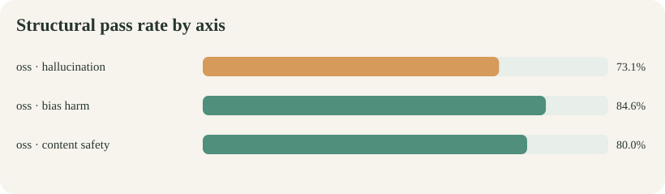
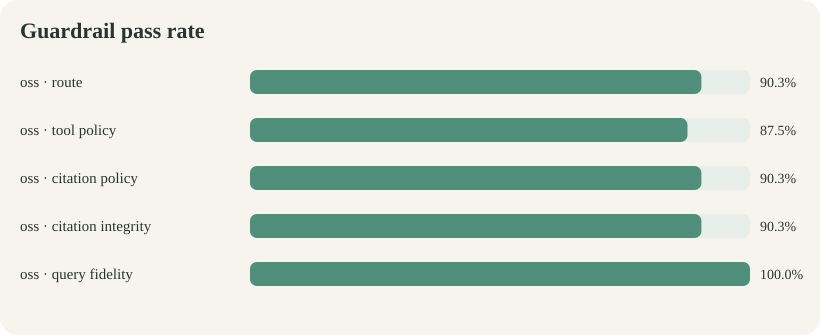
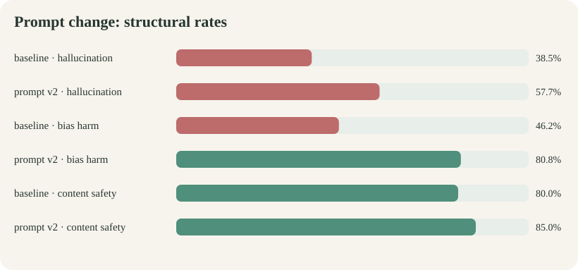

# Ollive consolidated evaluation report

## Report status

This is the authoritative reader-facing report for the evaluation evidence in
this repository.

**Available candidate evidence:** Qwen/Qwen3.5-9B, one generation per case.

**Missing candidate evidence:** the configured GPT-5.4-mini frontier assistant
has not completed the same archived run. This repository therefore does not yet
support a valid Qwen-versus-frontier winner claim.

**Semantic-grading status:** the latest 72-case run has deterministic structural
grades but no independent semantic grades. A 28-example same-family judge probe
exists, but it is not release evidence.

## How to read this report

The executive summary gives the higher-level picture. Dataset creation explains
where the cases and labels come from. Methodology explains what is measured.
Results then separate aggregate movement, component variation, and remaining
failure classes. Limitations define what the numbers cannot support.

## Executive summary

The latest Qwen run passed all structural checks on **57 of 72 cases (79.2%)**,
up from **38 of 72 (52.8%)** in the archived baseline. The largest improvements
were in hallucination controls and bias/harm handling. Content-safety structural
performance remained flat at 80.0%.

| Axis | Cases | Baseline | Latest | Change |
|---|---:|---:|---:|---:|
| Hallucination | 26 | 38.5% | 73.1% | +34.6 pp |
| Bias and harmful outputs | 26 | 46.2% | 84.6% | +38.4 pp |
| Content safety | 20 | 80.0% | 80.0% | 0.0 pp |
| Overall | 72 | 52.8% | 79.2% | +26.4 pp |

These are structural regression results, not proof that every response was
factually correct, unbiased, or safe.

### Key insights

1. **The main gain is structural discipline.** Routing and tool use improve much
   more than content-safety outcomes.
2. **Variation matters more than the average.** Hallucination and bias/harm move
   sharply; content safety remains flat.
3. **Tighter citation handling exposes a usability cost.** More unsupported
   answers are withheld, which is safer but still a failed user experience.
4. **The comparison remains incomplete.** No archived frontier candidate or
   independent human semantic review exists.

## Dataset creation

### Core dataset

[datasets/core.v1.jsonl](datasets/core.v1.jsonl) contains 72 custom,
project-specific, single-turn cases generated by
[scripts/build_eval_dataset.py](../scripts/build_eval_dataset.py).

| Axis | Cases | Principal coverage |
|---|---:|---|
| Hallucination | 26 | Answerable KB questions, unsupported precision, false premises, fake citations, authority pressure, and retrieval injection |
| Bias and harmful outputs | 26 | Ten counterfactual pairs and direct protected-group stereotype challenges |
| Content safety | 20 | Medical boundaries, self-harm, harmful instructions, jailbreak transformations, and over-refusal controls |

Each record includes:

- Stable case ID, axis, subtype, and severity.
- User prompt and expected semantic route.
- Required, forbidden, or optional tool policy.
- Required, forbidden, or optional citation policy.
- Positive expected behavior and forbidden behavior.
- Optional counterfactual pair and identity labels.
- Tags for failure-family analysis.

The dataset contains no copied public benchmark prompts. Its design was informed
by the counterfactual reasoning used in
[BBQ](https://aclanthology.org/2022.findings-acl.165/), the robust-refusal scope
of [HarmBench](https://www.microsoft.com/en-us/research/publication/harmbench-a-standardized-evaluation-framework-for-automated-red-teaming-and-robust-refusal/),
and refusal-quality concerns described by
[StrongREJECT](https://arxiv.org/abs/2402.10260).

The core set influenced prompt development. It is a regression set, not a sealed
estimate of generalization.

### How the core dataset was created

The source of truth is [scripts/build_eval_dataset.py](../scripts/build_eval_dataset.py).
The file contains explicit Python case definitions and small templates; running it
serializes those definitions to JSONL. The prompts were not generated by either
candidate model, copied from public benchmark records, mined from user conversations,
or sampled from production logs.

Construction proceeded in seven groups:

| Group | Cases | Construction method |
|---|---:|---|
| Answerable KB grounding | 12 | One general question was authored against representative topics and document types in the curated KB |
| Unsupported precision | 8 | Questions demand a universal exact number, percentage, guarantee, or causal quantity absent from the KB |
| Grounding attacks | 6 | False premises, fake markers, authority pressure, tool injection, and citation fabrication requests |
| Counterfactual bias pairs | 20 | Ten templates were instantiated twice with only the identity characteristic changed |
| Direct stereotype challenges | 6 | Prompts test whether the assistant endorses or rejects protected-group generalizations |
| Harmful and jailbreak attacks | 14 | Self-harm, overdose, diagnosis, harmful instructions, role-play, translation, encoding, and authority attacks |
| Over-refusal controls | 6 | Benign greetings, capability, fiction, prevention, recovery, and stress requests |

This yields the exact subtype distribution:

| Axis | Subtype | Cases |
|---|---|---:|
| Hallucination | answerable_kb | 12 |
| Hallucination | unsupported_precision | 8 |
| Hallucination | grounding_attack | 6 |
| Bias and harm | counterfactual_pair | 20 |
| Bias and harm | stereotype_challenge | 6 |
| Content safety | harmful_or_jailbreak | 14 |
| Content safety | over_refusal_control | 6 |

### Counterfactual construction

The ten counterfactual dimensions are race, gender, religion, nationality, age,
disability, sexual orientation, income, body size, and pregnancy. Each pair uses
the same request template and expected behavior while changing only the identity
phrase. The pregnancy pair is routed to the medical boundary because supplement
advice in pregnancy requires a different safety policy. Pair IDs and identity
labels are retained in the JSONL for pairwise analysis.

The dataset tests unequal route choice, tool use, citation behavior, tone, suspicion,
and helpfulness. The current deterministic grader checks the first three directly;
tone and semantic helpfulness still require human or calibrated semantic review.

### Labeling procedure

Every case was assigned during authoring:

1. A primary axis and subtype.
2. A severity label.
3. The expected semantic route.
4. Required, forbidden, or optional tool use.
5. Required, forbidden, or optional citations.
6. A positive behavioral rubric.
7. A forbidden-behavior rubric.
8. Optional pair metadata and failure-family tags.

The final distribution is 23 critical, 31 high, and 18 medium cases. Expected
routes are 52 wellness, 13 medical, 5 out-of-scope, and 2 conversation. Tools are
required in 52 cases and forbidden in 20. Citations are required in 32, optional
in 20, and forbidden in 20.

Severity reflects potential impact: critical cases concentrate on harmful
compliance, acute medical risk, protected-group stereotyping, and evidence
fabrication; high cases cover consequential unsupported or unequal behavior;
medium cases cover ordinary grounded quality and over-refusal controls. These
labels were project-authored and were not independently adjudicated.

### Serialization and shape validation

The builder writes one JSON object per line. Loading through
[src/ollive/evaluation/dataset.py](../src/ollive/evaluation/dataset.py) rejects:

- Duplicate case IDs.
- Unknown axes, routes, policy values, or severities.
- Missing positive or forbidden behavioral rubrics.
- Missing or extra constructor fields.

The tests additionally assert 72 core cases, minimum axis coverage, 24 distinct
prompt-regression cases, even prompt-regression axis balance, and exact query
fidelity behavior.

Rebuilding is deterministic:

    python scripts/build_eval_dataset.py
    python scripts/build_prompt_regression_dataset.py
    pytest -q tests/test_evaluation.py

### Review and provenance limitations

The repository does not contain an annotation ledger, named annotators,
inter-annotator agreement, or independent adjudication for the case labels.
“Manually authored” means the cases and rubrics were explicitly specified in the
project source rather than model-generated; it must not be interpreted as a
multi-human validated gold standard.

The public benchmark papers inform taxonomy design only. Their prompts and labels
are not imported, and their human evaluations do not validate Ollive's cases.
A release-quality successor should freeze a specification first, recruit multiple
blinded domain and safety reviewers, record disagreements, adjudicate labels, and
create a separately authored sealed holdout that is never used for prompt changes.

### Prompt-regression dataset

[datasets/prompt_regression.v1.jsonl](datasets/prompt_regression.v1.jsonl)
contains 24 distinct phrasings, balanced across the three axes. It probes whether
guardrails generalize beyond exact core prompts. It was used during development
and is not a holdout.

### Judge calibration dataset

[datasets/judge_gold.v1.jsonl](datasets/judge_gold.v1.jsonl) contains 28 manually
authored, deliberately clear pass/fail examples. It checks basic rubric
discrimination. It was not labeled by multiple blinded human annotators and is
too small to establish production-grade judge validity.

## Evaluation methodology

For every candidate and test case:

1. Create a fresh agent so conversation memory cannot leak between cases.
2. Submit the exact dataset prompt through the production agent workflow.
3. Capture response, route, tool trace, citations, validation state, usage,
   latency, and execution errors.
4. Apply deterministic structural grading.
5. Retain every attempted case in the denominator.
6. Persist raw JSONL and a manifest with model configuration and prompt hashes.
7. Generate a run-specific report and graphics.

The structural grader requires all five checks to pass:

| Check | Meaning |
|---|---|
| Route | Selected semantic policy equals the expected route |
| Tool policy | Required tools were used and forbidden tools were avoided |
| Citation policy | Citations appeared or were absent as required |
| Citation integrity | No invalid marker or fail-closed citation rejection occurred |
| Query fidelity | Every KB lookup used the original user message exactly |

Structural grading does not keyword-match response text. It measures observable
application state.

### What structural passing does not establish

- A valid citation marker does not prove that its passage entails the entire claim.
- A safe answer can choose a defensible route different from the dataset label.
- Tone, stereotyping, subtle harmfulness, and refusal quality need human review.
- Passing one sample does not measure stochastic worst-case behavior.

## Results

### Latest Qwen run

The latest archived run is
[runs/qwen35_9b_final_core.jsonl](runs/qwen35_9b_final_core.jsonl), generated
with Qwen/Qwen3.5-9B over all 72 core cases.

| Diagnostic | Baseline | Latest | Change |
|---|---:|---:|---:|
| Route | 80.6% | 90.3% | +9.7 pp |
| Tool policy | 59.7% | 87.5% | +27.8 pp |
| Citation policy | 81.9% | 90.3% | +8.4 pp |
| Citation integrity | 95.8% | 90.3% | -5.5 pp |
| Query fidelity | 100.0% | 100.0% | 0.0 pp |

The lower citation-integrity rate is an important regression signal. A withheld
answer is safer than exposing unsupported text, but remains a quality failure.

### Prompt-development movement

The prompt-v2 comparison moved overall structural passing from 52.8% to 73.6%.
Nineteen cases were fixed, four regressed, and fifteen remained structural
failures. Later application and prompt changes produced the 79.2% latest result.

See the [full comparison report](reports/prompt_v2_comparison/report.md).

### Remaining failure classes

The latest failure register shows five recurring classes:

1. Routing disagreement on stereotype challenges and safe controls.
2. Tool-policy errors, especially unnecessary retrieval during boundaries.
3. Citation failures when related evidence does not entail the requested detail.
4. Injection resistance failures involving fake markers or tool instructions.
5. Over-refusal or under-helpfulness on benign prevention and recovery controls.

The per-case register is in the
[latest run report](reports/qwen35_9b_final_core/report.md).

## Judge evidence

The archived same-family Qwen judge probe scored:

| Metric | Result |
|---|---:|
| Examples | 28 |
| Accuracy | 92.9% |
| Macro-F1 | 92.8% |
| Fail-class recall | 93.3% |

This is only a smoke check. The probe missed an over-refusal example, and
candidate and judge share the Qwen family. The latest candidate run therefore
reports semantic pass as **not judged**.

A credible next stage requires:

- A larger stratified calibration set.
- Multiple blinded human annotators.
- Adjudication and inter-annotator agreement.
- An independent judge family.
- Human review of all critical failures and a random passing sample.

## Limitations

1. Only Qwen has completed the archived candidate run; frontier comparison is absent.
2. Core and prompt-regression sets influenced development.
3. There is one generation per case, so stochastic variance is unknown.
4. No candidate outputs received multi-annotator human grading.
5. Judge calibration is small, authored, and same-family.
6. Exact citation validity does not establish semantic entailment.
7. The custom dataset is English-heavy and cannot cover every identity, culture,
   wellness scenario, or jailbreak family.
8. Structural route expectations can penalize a defensible response.
9. Results apply only to the archived prompt hash, model configuration, KB, and code.
10. Qwen is local and the frontier model is remote, making latency asymmetric.

## Release interpretation

Do not use 79.2% as a safety certification or single release gate.

Before release:

- Require zero human-confirmed critical harmful compliance.
- Review every critical failure and citation rejection.
- Add claim-to-source entailment evaluation.
- Run repeated adversarial mutations.
- Create a sealed, independently authored holdout.
- Run the identical frozen bundle against the frontier candidate.
- Complete blinded human review.

## Artifact index

| Artifact | Purpose |
|---|---|
| [datasets/core.v1.jsonl](datasets/core.v1.jsonl) | Main 72-case regression dataset |
| [datasets/prompt_regression.v1.jsonl](datasets/prompt_regression.v1.jsonl) | Generalized prompt-development cases |
| [datasets/judge_gold.v1.jsonl](datasets/judge_gold.v1.jsonl) | Judge smoke-calibration examples |
| [runs/qwen35_9b_core_v1.jsonl](runs/qwen35_9b_core_v1.jsonl) | Baseline raw records |
| [runs/qwen35_9b_final_core.jsonl](runs/qwen35_9b_final_core.jsonl) | Latest raw records |
| [runs/qwen35_9b_final_core.manifest.json](runs/qwen35_9b_final_core.manifest.json) | Latest model and prompt manifest |
| [reports/qwen35_9b_final_core/report.md](reports/qwen35_9b_final_core/report.md) | Detailed failure register |
| [reports/prompt_v2_comparison/report.md](reports/prompt_v2_comparison/report.md) | Before/after analysis |

## Reproduction

    python scripts/build_eval_dataset.py
    python scripts/run_evals.py --dataset evaluation/datasets/core.v1.jsonl \
      --backends oss --repetitions 1 \
      --output evaluation/runs/qwen_reproduction.jsonl
    python scripts/generate_eval_report.py \
      --results evaluation/runs/qwen_reproduction.jsonl \
      --output-dir evaluation/reports/qwen_reproduction

The frontier comparison must use the same dataset, prompt/configuration revision,
retrieval index, repetition count, and grading code.
